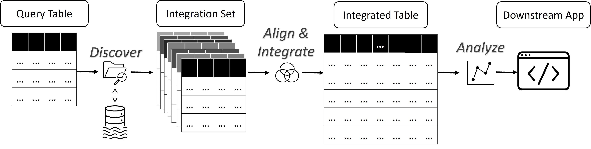

# DIALITE: Discover, Align and Integrate Open Data Tables 

This repository contains the implementation codes for our demo paper: DIALITE, presented at [SIGMOD 2023](https://2023.sigmod.org/). 

Authors: Aamod Khatiwada, Roee Shraga and Renée J. Miller

Paper and demonstration video: [https://dl.acm.org/doi/10.1145/3555041.3589732](https://dl.acm.org/doi/10.1145/3555041.3589732)

Link to the demo website: 
[https://tinyurl.com/dialite-sigmod](https://tinyurl.com/dialite-sigmod)

<!-- Link to the demonstration video (using Jupyter Notebook): 

 [https://drive.google.com/file/d/1hFWq5QkGFigBURcwVebBtZi5R5Xv9rfq/view?usp=sharing](https://drive.google.com/file/d/1hFWq5QkGFigBURcwVebBtZi5R5Xv9rfq/view?usp=sharing). -->

*Block Diagram of DIALITE System*

## Abstract

We demonstrate a novel table discovery pipeline called DIALITE that allows users to discover, integrate and analyze open data tables. DIALITE has three main stages. First, it allows users to discover tables from open data platforms using state-of-the-art table discovery techniques. Second, DIALITE integrates the discovered tables to produce an integrated table. Finally, it allows users to analyze the integration result by applying different downstreaming tasks over it. Our pipeline has a flexible architecture such that the user can easily add and compare additional discovery and integration algorithms.

## Repository Organization

- **alite** folder contains ALITE codes adopted from its [original implementation](https://github.com/northeastern-datalab/alite).
- **data** folder contains the sub-folders for sample datasets and placeholder for additional datasets.
- **dialite.png** file shows the block diagram of DIALITE system.
- **join** folder contains the joinability system codes. 
- **santos** folder contains SANTOS codes and indexes adopted from its [original implementation](https://github.com/northeastern-datalab/santos).
- **README.md** file explains the repository.
- **requirements.txt** file contains necessary packages to run the project.
- **templates** folder contains frontend code for the demo website.
- **yago** folder is placeholder for [YAGO](https://yago-knowledge.org/) knowledge base files.
- **\*.ipynb** files are example notebooks to run the demo without using web api.
- **\*.py** files contain python flask backend codes for the demo website.

## Setup

1. Clone the repo

2. CD to the repo directory. Create and activate a virtual environment for this project. We recommend using python version 3.7 or higher.  
  * On macOS or Linux:
      ```
      python3 -m venv env
      source env/bin/activate
      which python
      ```
  * On windows:
      ```
      python -m venv env
      .\env\Scripts\activate.bat
      where.exe python
      ```

3. Install necessary packages. 
   ```
   pip install -r requirements.txt
   ```

## Reproducibility

1. CD to the repo.

2. Run the following command that downloads preprocessed yago files from [this link](https://drive.google.com/drive/folders/1FhvwxE0_iDO8Xy4jI7uq7roZSNXOJGr1?usp=share_link) and uploads them to [yago](yago) folder.
    ```
    cd yago && gdown --folder https://drive.google.com/drive/folders/1FhvwxE0_iDO8Xy4jI7uq7roZSNXOJGr1 && mv yago/* ../ && rm -r yago && cd ../
    ```
3. Preprocess your data lake using [SANTOS](https://github.com/northeastern-datalab/santos) and upload the indexes to [santos/hashmap](santos/hashmap) folder. All index file names must start with: dialite_datalake as shown below.
    ```
    dialite_datalake_main_relation_index.pickle
    dialite_datalake_main_triple_index.pickle
    dialite_datalake_main_yago_index.pickle
    dialite_datalake_synth_relation_inverted_index.pbz2
    dialite_datalake_synth_relation_kb.pbz2
    dialite_datalake_synth_type_inverted_index.pbz2
    dialite_datalake_synth_type_kb.pbz2
    ```
    Alternatively, you can also run the following command that downloads the preprocessed indexes for [SANTOS Small Benchmark](https://zenodo.org/record/7758091) from [this link](https://drive.google.com/drive/folders/1-1smQ5aD6iZLQcvdW6l_n2RhjhzY1UT_?usp=sharing).

    ```
    cd santos/hashmap && gdown --folder https://drive.google.com/drive/folders/1-1smQ5aD6iZLQcvdW6l_n2RhjhzY1UT_ && mv santos_hashmap/* ../ && rm -r santos_hashmap && cd ../../
    ```

4. Upload your data lake tables to [data/dialite_datalake](data/dialite_datalake) folder. You can run the following command that downloads SANTOS Small Benchmark and use it as a data lake. Note that we also provide the preprocessed indexes in the previous step for this benchmark. 
    ```
    cd data/dialite_datalake && zenodo_get 7758091 && unzip santos_benchmark.zip && cd santos_benchmark && mv * ../ && cd ../ && rm -r santos_benchmark && rm *.zip & cd ../
    ```

5. Set Environment Variables.
  * On macOS or Linux:
    ```
    export FLASK_APP=main.py
    export FLASK_DEBUG=1
    ```

  * On Windows:
    ```
    set FLASK_APP=main.py
    set FLASK_DEBUG=1
    ```
    If you want to turn off the debug mode, set FLASK_DEBUG=0.

6. Start Flask Application in a terminal.
    ```
    python main.py
    ```

7. Open the link shown in the terminal using any web browser. The browser must support HTML5 and javascript.

## Citation
```
@inproceedings{DBLP:conf/sigmod/KhatiwadaSM23,
  author       = {Aamod Khatiwada and
                  Roee Shraga and
                  Ren{\'{e}}e J. Miller},
  title        = {{DIALITE:} Discover, Align and Integrate Open Data Tables},
  booktitle    = {Companion of the 2023 International Conference on Management of Data,
                  {SIGMOD/PODS} 2023, Seattle, WA, USA, June 18-23, 2023},
  pages        = {187--190},
  publisher    = {{ACM}},
  year         = {2023},
  url          = {https://doi.org/10.1145/3555041.3589732},
  doi          = {10.1145/3555041.3589732}
}
```
